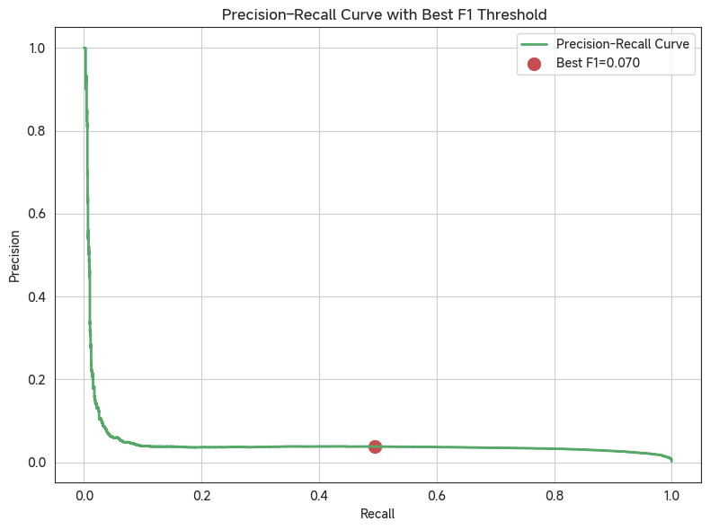
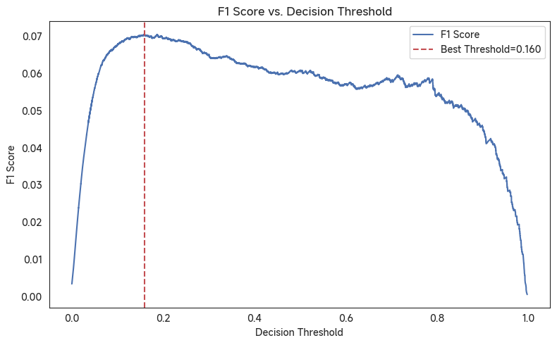
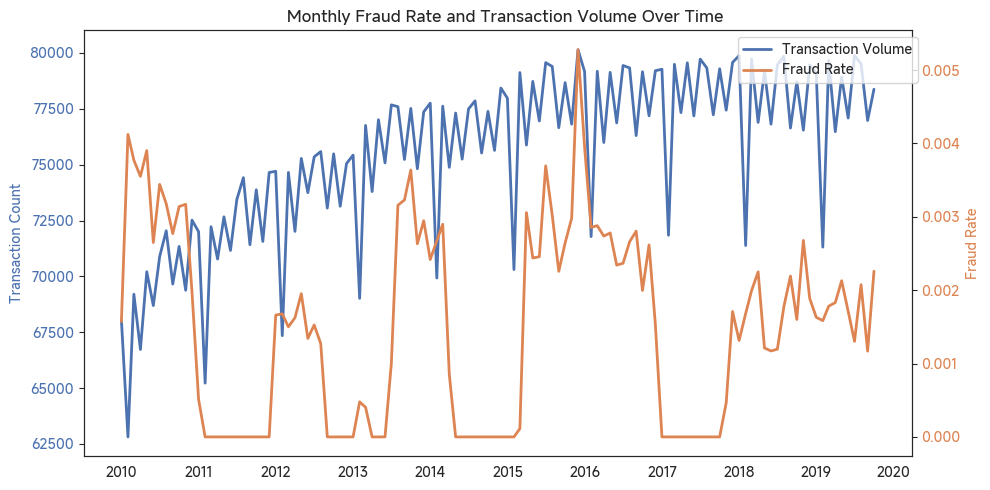
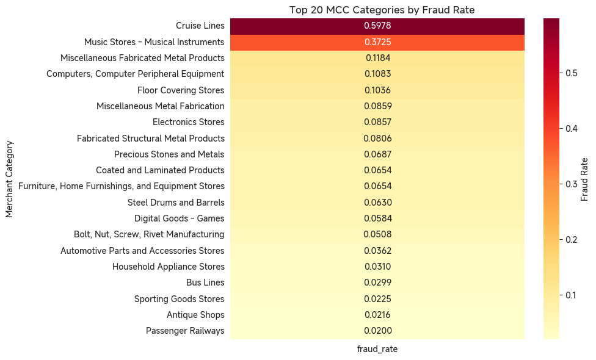

# Fraud Detection and Financial Risk Modeling
**End-to-end fraud detection and financial risk modeling system (13M+ transactions) integrating EDA, feature engineering, LightGBM optimization, and explainable AI for business risk auditing.**

[]()
[]()
[]()
[]()

---

## 📘 Overview
This project builds a **data-driven fraud detection pipeline** capable of identifying suspicious financial transactions from over **13 million records**.  
It combines **exploratory data analysis**, **feature engineering**, **imbalanced learning**, and **interpretable machine learning** to deliver actionable business insights.



---

## ⚙️ Workflow Architecture
```

Data Loading → EDA → Feature Engineering → Class Balancing →
LightGBM Training → Threshold Optimization → SHAP Interpretability → Risk Report

```


### 🧩 Core Steps
| Stage | Description |
|-------|--------------|
| **Data Preparation** | Cleaned and merged `transactions`, `users`, `cards`, and `MCC` data (13M+ rows). |
| **EDA & Visualization** | Distribution, outlier, and geographic/industry-level fraud analysis. |
| **Feature Engineering** | Constructed 20+ numerical, categorical, and time-based features (`amount_log`, `is_refund`, `hour`, `mcc_desc`, etc.). |
| **Class Balancing** | Undersampling strategy (10× ratio) to stabilize LightGBM training. |
| **Model Training** | Tuned LightGBM (GBDT) with early stopping and AUC optimization. |
| **Explainability (SHAP)** | Interpreted feature contributions globally and locally (fraud driver visualization). |
| **Threshold Tuning** | Optimized precision–recall trade-off with decision curve visualization. |
| **Business Application** | Exported Top-200 high-risk transactions for manual verification. |

## 📊 Model Performance

### Before & After Threshold Optimization

| Metric                 | Default Threshold (0.5) | Tuned Threshold (0.1598) |          Δ Improvement |
| :--------------------- | ----------------------: | -----------------------: | ---------------------: |
| **AUC (Validation)**   |                  0.9718 |                   0.9718 |                      — |
| **Precision**          |                  0.0374 |                   0.0379 |                +0.0005 |
| **Recall**             |                  0.1601 |               **0.4941** |            **+0.3340** |
| **F1 Score**           |                  0.0606 |               **0.0704** |                +0.0098 |
| **Detection Coverage** |                   0.74% |                **2.28%** | ↑ Expanded audit scope |

**Interpretation:**  
- After tuning the decision threshold, Recall improved from **16.0% → 49.4%**, tripling fraud coverage while maintaining similar precision (~0.04).  
- The optimized configuration balances model confidence and operational feasibility — ideal for financial audit pipelines where human verification capacity is limited.

---

## 🗂️ Dataset Description

### **[Kaggle: Financial Transactions EDA](https://www.kaggle.com/code/mariemwaleed178/financial-transactions-eda)**

This comprehensive financial dataset originates from a banking institution and spans across the 2010s decade.  
It combines transaction logs, customer profiles, and card information — designed for analytical tasks such as fraud detection, customer behavior modeling, and expense forecasting.

### Dataset Components
| File                        | Description                                                  | Purpose                                                |
| --------------------------- | ------------------------------------------------------------ | ------------------------------------------------------ |
| **transactions_data.csv**   | Detailed transaction records with timestamps, merchant IDs, and amounts. | Core input for fraud detection and trend analysis.     |
| **cards_data.csv**          | Credit/debit card metadata including card type, limits, and activation dates. | Links customer financial activity across accounts.     |
| **users_data.csv**          | Customer demographic and account-level data.                 | Enables segmentation and personalized analytics.       |
| **mcc_codes.json**          | Standardized merchant category codes (MCC).                  | Classifies business types for industry-level analysis. |
| **train_fraud_labels.json** | Binary labels indicating legitimate vs. fraudulent transactions. | Supervised training and evaluation.                    |

## 🌍 Explainability

- **Global Importance:** `amount_log`, `hour`, `mcc_desc`, and `client_mean` drive fraud prediction.  
- **Local Explanation:** SHAP force plots reveal how transaction timing and amount deviations trigger risk alerts.  
- **Interpretability Goal:** bridge **model confidence** and **financial analyst reasoning**.

## 📦 Exported Deliverables
| Output File | Description |
|--------------|-------------|
| `main.ipynb` | Full pipeline notebook with 19 modular cells |
| `main.html` | Rendered analysis report |
| `high_risk_transactions_top200.csv` | Top 200 suspicious transactions ranked by fraud probability |
| `.gitignore` | Excludes large data files (JSON/CSV over 100 MB) |

## 🧰 Tech Stack
- **Python 3.10 + Pandas + NumPy**
- **LightGBM 4.3.0** (with callbacks for early stopping & AUC logging)
- **Matplotlib / Seaborn** (visual analytics)
- **SHAP 0.43.0** (explainable AI)
- **Scikit-learn 1.4+** (precision-recall & threshold tuning)


## 💡 Business Impact
This project demonstrates a scalable, interpretable fraud detection framework ready for integration into financial risk control systems, enabling **data-driven decision intelligence for early fraud prevention and compliance assurance.**


## 📈 Author
**Republic** (GitHub: [Republic1024](https://github.com/Republic1024))   (AI & Data Science)  


## License
This project is released under the [MIT License](LICENSE).

